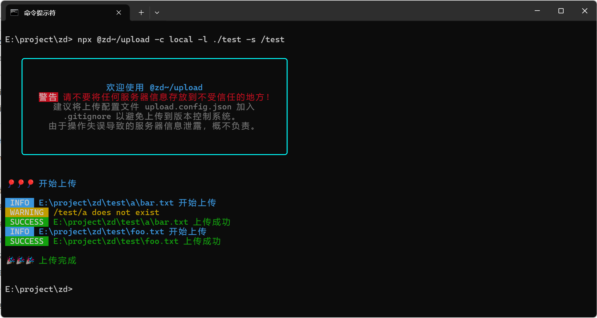

# @zd~/upload

一个基于 [basic-ftp](https://www.npmjs.com/package/basic-ftp) 和 [ssh2-sftp-client](https://www.npmjs.com/package/ssh2-sftp-client) 的 FTP/SFTP 上传工具。它可以帮助你快速将本地资源上传到 FTP/SFTP 服务器。

> [!IMPORTANT]
> 默认情况下，上传操作会覆盖原有文件。如果需要恢复原文件，请务必先进行备份。



## 使用方法

### 安装

你可以通过以下命令全局安装此工具：

```bash
npm i -g @zd~/upload
```

或者，使用 `npx` 命令直接运行：

```bash
npx @zd~/upload -l ./test/ -s /home/test
```
### 配置
首次运行该工具时，会在当前用户的主目录下生成一个配置文件 upload.config.json。主目录路径如下：
- Windows: `%USERPROFILE%`
- Linux 和 `macOS: `~` 或 `$HOME`

请根据实际需求修改该配置文件：

```json
{
  "example": {
    "host": "127.0.0.1",
    "port": 22,
    "username": "root",
    "password": "123456"
  }
}
```
- example：配置名称
- host：主机地址
- port：端口号
- username (可选)：用户名
- password (可选)：密码

### 使用
配置完成后，你可以使用以下命令进行文件上传：

```bash
npx @zd~/upload -l 本地文件路径 -s 目标服务器路径
```

如果你有多个配置，可以通过以下命令选择特定配置进行上传：

```bash
npx @zd~/upload -c 配置名称 -l 本地文件路径 -s 目标服务器路径
```

### 配置选择
在使用时，如果存在多个配置且你未指定任何一个配置，你也可以使用上下箭头（↑↓）选择不同的配置进行上传。

感谢使用 `@zd~/upload`。如果你有任何问题或建议，请随时联系我。
